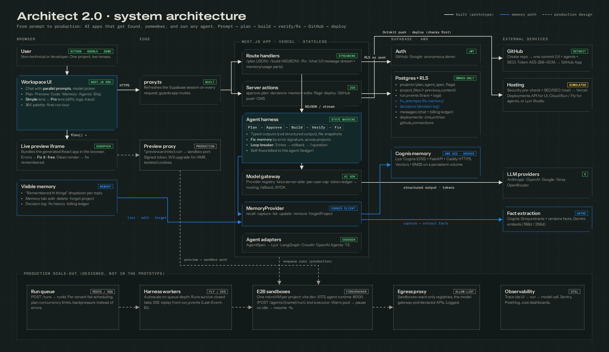
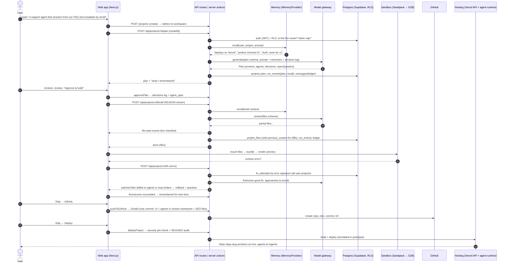
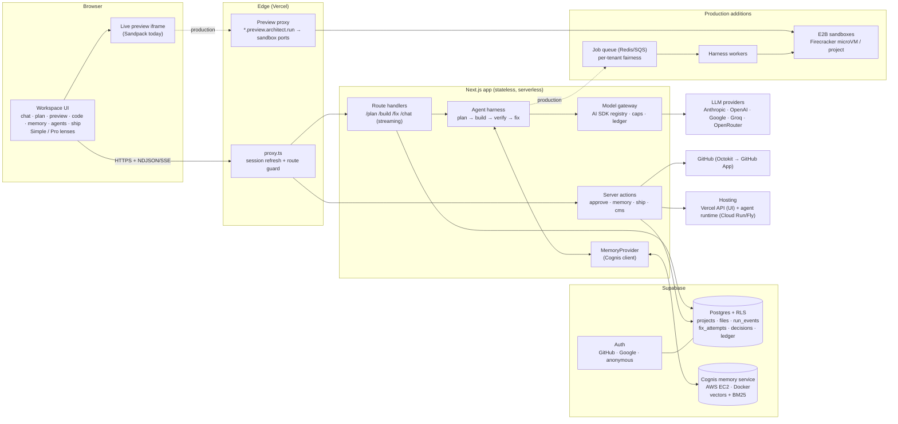
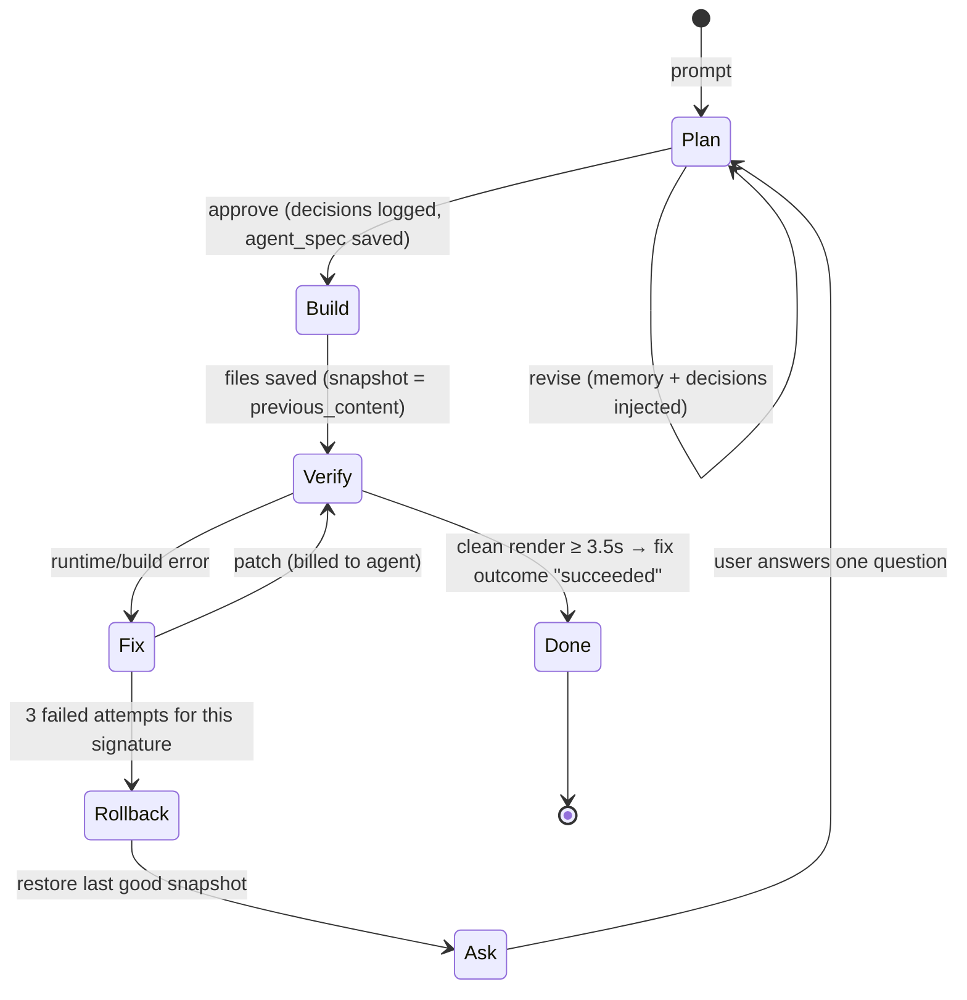
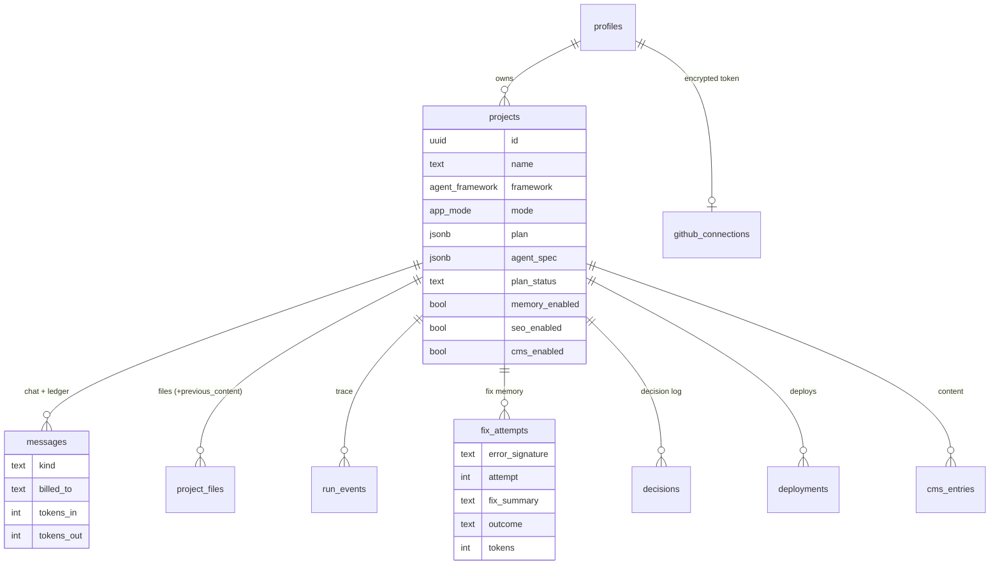

# Architect 2.0: Architecture

> **From prompt to production: AI apps that get found, remember, and run any agent.**
>
> Architect 2.0 is a vibe-coding platform for AI agents, for people who can't code and for people
> who can. This document walks through what happens from the moment a user types a prompt to the
> moment their app is running live. For each piece it covers why it is built that way, what else was
> considered, and how it scales.
> Each section says what the **prototype** does today (the deployed URL) and what the
> **production** design is. Decisions are recorded in [`docs/decisions.md`](docs/decisions.md).



*Diagram source: [`docs/architecture/diagram.html`](docs/architecture/diagram.html), exported to
PNG. Mermaid versions of the main views are below, so they render on GitHub.*

---

## Contents

1. [The idea in one paragraph](#1-the-idea-in-one-paragraph)
2. [From prompt to live app](#2-from-prompt-to-live-app-the-walkthrough)
3. [System overview](#3-system-overview)
4. [The memory layer](#4-the-memory-layer-the-engine)
5. [The agent harness](#5-the-agent-harness-plan--build--verify--fix)
6. [Sandboxes and live preview](#6-sandboxes-and-live-preview)
7. [Model-agnostic: the model gateway](#7-model-agnostic-the-model-gateway)
8. [Agent-agnostic: one spec, any framework](#8-agent-agnostic-one-spec-any-framework)
9. [Frontend ↔ backend ↔ sandbox](#9-frontend--backend--sandbox)
10. [The proxies](#10-the-proxies)
11. [GitHub](#11-github)
12. [Deployment: user apps and Architect itself](#12-deployment-user-apps-and-architect-itself)
13. [Scaling to thousands of concurrent users](#13-scaling-to-thousands-of-concurrent-users)
14. [Security and multi-tenancy](#14-security-and-multi-tenancy)
15. [Data model](#15-data-model)
16. [Prototype: real vs simulated](#16-prototype-real-vs-simulated)
17. [Failure modes](#17-failure-modes)

---

## 1. The idea in one paragraph

Architect 2.0 takes a user from **prompt to production**. It builds apps that **get found** (SEO +
GEO built in, so Google *and* AI answer engines can read and quote them), that **remember** (a
builder that learns how each user builds, plus memory for the agents users ship), and that **run
any agent** (one agent spec compiled to Lyzr, LangGraph, CrewAI, OpenAI Agents SDK or TypeScript).
The memory layer is what makes the loop feel different from every other vibe-coding tool:
- **Fix memory** never repeats a failed fix and reuses fixes that worked, across all your projects.
- A **loop breaker** stops after three failed attempts, rolls back, and asks one question.
- A **fair-billing ledger** charges the agent, not you, for its own fixes.
- **Builder memory** and a **decision log** stop it re-asking what you already settled.
- **Visible memory** shows, edits and deletes all of the above.

Builder memory runs on Lyzr Cognis (open source), and you can switch memory on for the agents you build (Cognis in
production). Everything else follows the familiar vibe-coding flow (prompt → plan → build →
preview → deploy), so there's nothing new to learn.

---

## 2. From prompt to live app (the walkthrough)

This is the spine of the system. The numbers match the sequence diagram below.



**Step by step:**

1. **Prompt.** The user types an idea on the homepage. A project row is created (Postgres, RLS
   owner-only) and the user lands in the workspace. Chat sits on the left; the Plan / Preview /
   Code / Memory / Agents / Ship tabs sit on the right. A five-step tour runs the first time.
2. **Auth and budget.** Every API call checks the Supabase session (`proxy.ts` refreshes it on
   every request), loads the project *as the user*, so RLS decides access, and checks the user's
   daily token cap. Demo-mode guests get a lower cap.
3. **Recall.** Before any model call, the harness asks the `MemoryProvider` for memories relevant
   to this prompt (`recall(userId, projectId, query)`). Builder memory is per *user*, so it carries
   over between projects. The **decision log** for this project is always injected.
4. **Plan.** The model gateway generates a typed `Plan` (zod schema): screens, user stories,
   **agents** (role, instructions, tools, memory, hand-offs; zero if the app doesn't need AI, such as
   a portfolio site), data sources, decisions and one open question. The UI shows exactly which memories shaped it.
5. **Approve.** Approval locks the plan, writes its decisions to the decision log and stores the
   agents as the project's `agent_spec`. That spec is framework-neutral (§8).
6. **Build.** The harness streams a typed `files[]` object. As each file path appears, the UI ticks
   it off a live checklist ("UI getting built"). Files are saved with their previous version, so
   Pro mode can show diffs. Architect adds `/agents.ts`, the one module the UI uses to call agents
   (`runAgent(name, input)`).
7. **Preview.** The files are mounted in a sandbox and rendered in an iframe:
   - **Prototype:** Sandpack bundles the React app in the browser.
   - **Production:** an E2B microVM runs `vite dev` behind the preview proxy.
8. **Verify and fix.** If the preview throws, the user clicks **Fix it · free**. The harness:
   - fingerprints the error;
   - looks up that fingerprint across *all* the user's projects (reuse what worked, avoid what
     failed);
   - patches the files and records the attempt, billed to the agent.

   A clean render for a few seconds marks the fix as *succeeded*, so it's remembered. After 3
   failures the **loop breaker** restores the last good snapshot and asks one clarifying question.
9. **Learn.** After each turn the conversation is passed to the memory provider, which extracts
   durable facts ("prefers Tailwind", "deploys on Vercel"). The Memory tab shows every fact, which
   project it came from and how often it was seen, and lets the user edit, delete or forget a whole
   project.
10. **Own the code.** **Ship → GitHub** creates a repo (first time) and pushes one commit with:
    - the UI in `src/`;
    - the agents compiled to the chosen framework (Lyzr, LangGraph, CrewAI, OpenAI Agents SDK or
      TypeScript);
    - the SEO/GEO files.
11. **Ship.** **Deploy** runs a security pre-check (secrets in client code, injection, eval, …) that
    blocks on high severity, scores SEO/GEO, then deploys:
    - **Production:** frontend to Vercel, agents to the agent runtime with an `/agents/{name}/run`
      endpoint, under `{slug}.architect.run`.
    - **Prototype:** streams realistic logs and records the deployment.

---

## 3. System overview



| Component | Prototype (deployed) | Production design | Why |
| --- | --- | --- | --- |
| Web app | Next.js 16 App Router on Vercel, server components by default | Same | Streaming RSC, edge network, preview deploys per branch |
| Auth | Supabase Auth: GitHub, Google, anonymous demo | + email and SSO for orgs | Postgres-native RLS uses the same JWT |
| Database | Supabase Postgres, owner-only RLS on every table | + read replicas, Supavisor pooling | RLS is the security boundary; no hand-rolled access checks to forget |
| Memory | Lyzr Cognis (open source) in a Docker service on AWS EC2, called over HTTPS (ADR-006) | Same service, scaled out; or hosted Cognis inside Lyzr | Lyzr's own memory engine; needs a disk and a warm process that Vercel lacks |
| Harness | In the route handler (one request per run, streamed) | Queue + workers (long-running, resumable) | Serverless time limits; fairness |
| Sandbox | Sandpack (browser bundler) | E2B Firecracker microVM per project | Real Node/Python, agents can execute, network egress control |
| Models | Vercel AI SDK with 5 providers, structured output | + capability routing, fallbacks, BYOK, cache | Model-agnostic by construction |
| GitHub | OAuth token (`repo`), AES-256-GCM at rest, Octokit Git Data API | GitHub App (per-repo install, 1-hour tokens), webhooks | Least privilege |
| Deploy | Simulated logs + real checks + deployment rows | Vercel Deployments API + agent runtime containers | Separate UI and agent scaling |

---

## 4. The memory layer (the engine)

Memory sits behind one interface (`lib/memory/provider.server.ts`), so the harness never knows
which backend it is talking to:

```ts
interface MemoryProvider {
  recall(who, query): Promise<RecalledMemory[]>;    // before every model call; never throws
  capture(who, turn): Promise<void>;                // after every turn; fact extraction is async
  list(userId, projectId): Promise<StoredMemory[]>; // Memory tab
  update(userId, id, content): Promise<boolean>;
  remove(userId, id): Promise<boolean>;
  forgetProject(userId, projectId): Promise<number>;
}
```

There are **four kinds of memory**, each stored where it fits best:

| Memory | What it holds | Store | Scope | Read by |
| --- | --- | --- | --- | --- |
| **Builder memory** | Durable facts about how this user builds ("deploys on Vercel", "hates modals") | Cognis memory service (vectors + BM25) | User, across projects | Plan, build, fix, chat (hybrid recall) |
| **Decision log** | Settled project decisions ("Auth: none for v1") | `public.decisions` | Project | Every turn, always injected (not just recalled) |
| **Fix memory** | error → diagnosed cause → attempted fix → outcome | `public.fix_attempts` | User, across projects | `/fix`, as graded hints |
| **Agent memory** | What each built agent remembers about *its* end users | Cognis, keyed by the app's end user | Per app end user | The deployed agents (toggle per agent) |

**Why split them?** Semantic recall is fuzzy: right for preferences, wrong for decisions, which
must *always* apply, and wrong for fixes, which need precise matching.

**Fix memory finds candidates; the model diagnoses.** The same error message can have different root
causes, so a lookup must never decide the fix on its own:
- **Two keys per error:**
  - a **signature**: `errorSignature()` hashes the message with paths, numbers, quoted values and
    IDs stripped, so "the same symptom" is recognised across runs and projects;
  - a **location**: `errorLocation()` takes the failing file plus the offending code line from the
    bundler's code frame.
- **Graded hints, not answers:**
  - A fix that succeeded for the same signature *at the same location* is a **strong hint**.
  - Fixes for the same message elsewhere are **weak hints** ("possibly a different reason").
  - Failed fixes are "do not repeat" only *at the same location*. Elsewhere they're "may not
    apply".
- **Diagnosis first:** the fixer must state the root cause from the *current* code before
  changing anything. It reports `usedKnownFix` only if its cause matches the hint's.
- **Every attempt stores its diagnosed cause** with the fix, so future hints are compared cause to
  cause, not just message to message.
- **Production:** match on meaning as well. Embed the error, its stack and the diagnosed cause, and
  retrieve by similarity, so the same cause with different wording is found, and the same wording
  with a different cause is down-weighted.

**Builder memory = Lyzr Cognis (ADR-006).** Architect runs the open-source Cognis engine
(`lyzr-cognis`, MIT) in its own service, `memory-service/`: FastAPI in Docker on AWS EC2, behind
Caddy for HTTPS. The Next.js app calls it through `MemoryProvider` with a bearer token.
- **Scoping:** owner = the user, agent = `architect-builder` (so facts follow the user across
  projects), session = the project. That's how the Memory tab knows "learned in this project" vs
  "from another project", and how *Forget this project* removes only facts learned here.
- **Capture:** after each turn, the app hands the exchange to the service, which queues it and
  answers immediately. A background worker runs Cognis's pipeline:
  1. An LLM (GPT-OSS 20B on Groq, via LiteLLM) extracts facts and files them in 13 categories.
  2. Each fact is embedded (Gemini, 768-d and 256-d Matryoshka vectors).
  3. The model decides ADD / UPDATE / CONTRADICT / DELETE against similar existing memories, so
     facts are versioned instead of duplicated.
- **Recall:** hybrid search: vector similarity (70%) fused with BM25 keyword match (30%) by
  Reciprocal Rank Fusion, plus a recency boost.
- **Edit:** uses Cognis's own update path. The old version is closed (kept as history) and the
  new text is stored re-embedded, linked to the old one, so recall matches the new meaning.
- **Why a separate service:** Cognis keeps its index in local files (in-process Qdrant + SQLite),
  so it needs a persistent disk and a long-lived process. Vercel functions are stateless,
  read-only and short-lived (§12).

**Visible memory UX:**
- Every reply has a collapsible *"Remembered N things"* dropdown showing exactly what was recalled,
  with relevance.
- The plan shows the memories that shaped it.
- The Memory tab lists everything, with source project, category and version, plus edit,
  delete and forget project.
- A per-project switch pauses memory entirely.

**Agent memory toggle:**
- Each agent in the Agents tab has a Memory switch, stored in `agent_spec`.
- The code generators turn it into the framework's native memory: Lyzr `MEMORY` feature (Cognis),
  LangGraph `store`, CrewAI `memory=True`, OpenAI Agents `Session`, or injected context in plain
  TypeScript.
- In the preview, `/agents.ts` simulates per-agent recall, so users can *see* the difference before
  they deploy.

---

## 5. The agent harness (plan → build → verify → fix)

The harness is a small state machine, not one giant prompt:



| Stage | Input | Output (typed) | Memory touchpoints |
| --- | --- | --- | --- |
| Plan | idea + revision | `planSchema` (zod → JSON schema → provider structured output) | recall builder memory; inject decision log |
| Build | approved plan | `generatedFilesSchema` streamed; `partialOutputStream` drives the live checklist | recall; capture "built X with Y" |
| Verify | preview runtime | error string or clean signal | — |
| Fix | error + current files | `fixSchema` (diagnosis, summary, changed files) | **fix memory**: known good fix, approaches to avoid; capture |
| Rollback | snapshot from first attempt | restored files + one question | marks attempts `rolled_back` (never retried) |

**Design choices:**
- **Typed outputs everywhere.** Each stage returns a zod-validated object, so the UI can render
  partial progress and nothing parses free text.
- **Checkpoints.**
  - Every file write keeps `previous_content`, so diffs and per-step revert are possible.
  - Every fix run stores a `before` snapshot in its trace event, which is what the loop breaker
    restores.
  - Production: a git commit per step in the sandbox repo.
- **Loop breaker budget:** 3 attempts per *error at the same location* in a project.
  - If the error comes back at the same place, the pending attempt is marked failed, and attempt N
    sees attempts 1..N-1 as "do not repeat".
  - If the same message appears somewhere else, it's treated as a new problem with its own budget.
    The earlier fix may well have worked.
  - Known fixes from history are offered as strong or weak hints. The model reuses one only when its
    own diagnosis finds the same cause.
- **Fair billing:**
  - Every model call writes a ledger row (`messages.kind`, `tokens_*`, `billed_to`).
  - Fix calls are `billed_to = 'agent'` and draw from a separate agent budget, never the user's
    daily cap.
  - The Memory → Billing ledger shows "Billed to you" vs "Absorbed by Architect".
- **Trace:** every step writes a `run_events` row (plan, recall, file, fix, error, check, deploy)
  with tokens. Pro mode renders these as Logs (terminal) and Trace (per-run timeline).
- **Parallel prompts:**
  - The chat runs each prompt as its own stream (one `Chat` instance per run).
  - A new prompt never interrupts a running one, and each answer lands under its own prompt.

**Production harness (beyond the prototype):**
- A typed tool set in the sandbox: `read_file`, `write_file`, `apply_patch`, `run`,
  `install`, `search_code`, `screenshot`, `run_tests`, `recall`, `remember`.
- A repo map for context; compaction past a token budget.
- A **testing agent** that clicks through the preview with Playwright and reports errors back into
  Verify.

Runs move to workers (§9) so they can last minutes, survive a closed tab, and resume.

---

## 6. Sandboxes and live preview

**Prototype: Sandpack.**
- Generated React + Tailwind files are bundled *in the user's browser* (CodeSandbox's bundler) and
  rendered in an iframe.
- Zero server cost, instant hot reload, and the bundler's error overlay feeds the Fix flow
  (`useErrorMessage`).
- Agents are simulated by the injected `/agents.ts`.

**Production: one E2B sandbox per project.**
- **What:** Firecracker microVMs from a prebuilt template (Node 22, Python 3.12, pnpm/uv, the
  framework SDKs, Playwright), started in about 150 ms from a snapshot.
- **Lifecycle:**
  - a **warm pool**, then assign on first open;
  - **pause** after 10 minutes idle (memory snapshot, no compute cost);
  - **resume** in about a second;
  - destroy after 7 days inactive; the repo in Git is the source of truth.
- **Inside:**
  - the app (`vite dev` on :5173);
  - the agent runtime (`uvicorn`/`node` on :8000, exposing `POST /agents/{name}/run`);
  - the harness's tool executor.
- **Isolation:** each VM has its own kernel, CPU/memory limits and no host network, with egress
  through the egress proxy (§10).

**Why E2B:** it's what current Architect already uses, has the fastest cold start of the managed
options, pause/resume and a mature SDK.

| Option | Why not (as the primary) |
| --- | --- |
| WebContainers | Browser-only Node; no Python, so no LangGraph or CrewAI; licensing for commercial use |
| Daytona / Modal | Good alternatives (Modal is great for Python jobs); weaker preview/port story than E2B |
| Fly Machines / plain containers | We'd build pooling, snapshots and port routing ourselves; containers are weaker isolation than microVMs for untrusted code |

**Live preview path (production):** the browser iframe loads
`https://5173-{sandboxId}.preview.architect.run`.
1. The preview proxy checks a short-lived signed cookie: is this user allowed to see this project?
2. It routes to the sandbox port and upgrades WebSockets for HMR.
3. Edits are written to the sandbox, and Vite hot-reloads.

---

## 7. Model-agnostic: the model gateway

- **One registry** (`lib/ai/registry.server.ts`) maps `provider:model` ids to Vercel AI SDK
  providers: Anthropic, OpenAI, Google, Groq, OpenRouter. Adding a provider means adding an entry.
- **The UI** shows every model, greys out providers with no key (`availableProviders()`), and sends
  `modelId` with each request. The server validates it (`ModelUnavailableError`).
- **Normalized I/O:** streaming text, structured output (zod), tool calls and token usage look the
  same for every provider, because the AI SDK normalizes them. The harness never branches on
  provider.
- **Keys are server-only**, from env vars. They never reach the browser.
- **Budgets:** a per-user daily token cap over the ledger, and a lower cap for anonymous demo users.
- **Production:**
  - a **capability matrix** (structured output, tools, context, vision, price) with **per-step
    routing**: a strong model for plan and fix, a fast model for small edits and chat;
  - **fallback** to the next capable model on 5xx, rate limit or refusal;
  - **BYOK** per user (encrypted like GitHub tokens);
  - prompt caching for the system prompt and decision log;
  - a pooled key set per provider to spread rate limits.

---

## 8. Agent-agnostic: one spec, any framework

Agents are defined once, as an **AgentSpec**: the `agentSchema` array (`name`, `role`,
`instructions`, `tools`, `memory`, `handsOffTo`). The UI edits the spec, never framework code.
**Adapters** (`lib/agents/codegen.ts`) compile it to:

| Target | Output | Hand-offs | Memory toggle becomes |
| --- | --- | --- | --- |
| **Lyzr** (default) | `lyzr_agents.py` via `lyzr-agent-api` | agent chaining | `MEMORY` feature with provider `cognis` |
| **LangGraph** | `graph.py`: `create_react_agent` nodes in a `StateGraph` | edges | `store=` long-term store |
| **CrewAI** | `crew.py`: `Agent`s and `Task`s in a `Crew` | `allow_delegation` | `memory=True` |
| **OpenAI Agents SDK** | `openai_agents.py`: `Agent(handoffs=[…])` | native handoffs | `SQLiteSession` per end user |
| **Plain TypeScript** | `agents.ts` on the Vercel AI SDK | function calls | memory injected into instructions |

**Runtime contract.** Whatever the framework, the agent runtime exposes
`POST /agents/{name}/run` (streaming events: `token`, `tool_call`, `tool_result`, `final`). The
generated UI calls agents only through `runAgent(name, input)` in `/agents.ts`, so switching
framework never touches the UI.
- In the preview, `/agents.ts` is a simulator.
- In production, it is a thin client for the endpoint.

**Pro users** can edit the generated code; a reverse-sync step (production) parses edits back into
the spec where possible and flags drift where not.

---

## 9. Frontend ↔ backend ↔ sandbox

- **Reads** are server components querying Supabase *as the user* (RLS applies), with no API layer
  to keep in sync.
- **Mutations** are server actions validated with zod: approve plan, decisions, memory edits, flags,
  deploy, GitHub, CMS. They `revalidatePath`, so the RSC payload refreshes.
- **Long model calls** are route handlers that stream:
  - chat: AI SDK UI message stream with `data-memory` and `data-usage` parts;
  - build: NDJSON events (`status`, `recall`, `file-start`, `done`, `error`);
  - plan and fix: JSON.
- **Client state:** a `WorkspaceProvider` holds plan, files and build state. The preview remounts
  when files change; the trace refreshes after each run.

**Production:**
- `POST /runs` enqueues a job (Redis Streams/SQS) and returns a `runId`. The browser subscribes to
  `GET /runs/:id/events` (SSE, resumable with `Last-Event-ID`).
- Workers run the harness and talk to the sandbox through the E2B SDK. Every event is appended to
  `run_events`, which is both the live stream source and the permanent trace.
- Closing the tab doesn't kill the run; reopening replays from the log.

---

### 9.1 Feature search (⌘K)

architect.new has no search. Architect 2.0's header has a **feature search**: type "cost",
"undo", "wordpress" or "how much am I paying" and jump straight to the place in the product that
does it. It opens the right tab and sub-view, and switches to Pro mode if the feature needs it.
- **Index:** `lib/features.ts` holds ~25 features. Each has a title, a summary, the synonyms
  people actually type, and a target (tab and view, page, UI element or action).
- **Prototype ranking: weighted text match.** Title beats synonym beats summary. It handles
  prefixes ("depl" → Deploy), light stemming ("paying" → pay), filler-word removal and a
  phrase bonus. Results show *where* the feature lives. With no match, it offers to ask the
  chat instead.
- **Production: semantic search.** Embed the feature index, the help docs and changelog entries.
  Query them with the same hybrid **vector + BM25** pipeline (Reciprocal Rank Fusion) the memory
  service already runs, so "put it on the internet" finds Deploy with no shared words.
  - Searches that open no result are logged; they show missing features and missing synonyms.
  - Results can be personalised with builder memory: a user who deploys often sees Deploy first.

## 10. The proxies

There are three different proxies. Each has one job.

1. **Session proxy (`proxy.ts`, built).** Next 16's request proxy refreshes the Supabase session
   cookie on every request and redirects signed-out users away from app routes. It is cheap,
   stateless and runs at the edge.
2. **LLM gateway (built as a module; a service in production).** All model traffic goes through the
   server:
   - keys stay server-side;
   - every call is metered into the ledger;
   - per-user caps;
   - production adds rate limiting (token bucket per user and org in Redis), response caching,
     fallbacks, and PII redaction in logs.
3. **Preview proxy (production).** Wildcard `*.preview.architect.run` at the edge:
   - verifies a signed, short-lived preview token (project-scoped);
   - maps `{port}-{sandboxId}` to the sandbox;
   - upgrades WebSockets;
   - preview cookies are isolated on a separate registrable domain, so a malicious generated app
     can't read Architect's cookies.
4. **Egress proxy (production)** for sandboxes:
   - an allow-list by default (package registries, the model gateway, the user's declared APIs);
   - logged, so a prompt-injected agent can't exfiltrate data to arbitrary hosts.

---

## 11. GitHub

**Prototype (built):**
- Sign in with GitHub requests the `repo` scope.
- The OAuth callback is the only moment Supabase exposes the provider token. We verify it against
  GitHub's `/user`, encrypt it with AES-256-GCM, and store it in `github_connections` (RLS:
  owner-only).
- **Push** uses the Git Data API so the whole project lands in **one commit**:
  1. `repos.createForAuthenticatedUser` (auto-init), the first time only;
  2. `git.createTree` (UI in `src/`, agents in the chosen framework, README, SEO files);
  3. `createCommit`;
  4. `updateRef`.
- `listGitHubRepos` powers import.

**Production:**
- A **GitHub App** instead of the OAuth `repo` scope: per-repo installation, 1-hour installation
  tokens, fine-grained permissions, and webhooks.
- **Import:** clone into the sandbox, detect the framework (`package.json` / `pyproject` / agent
  files), build a repo map, and seed builder memory from the code ("uses shadcn/ui").
- **Sync:**
  - a commit per agent step on a working branch;
  - one PR per change in Pro mode, with the trace linked in the PR body;
  - webhooks pull external pushes into the sandbox, so local edits (Cursor, Claude Code) round-trip;
  - the planned `architect` CLI / MCP bridge (`pull`, `dev`, `push`) uses the same path.

---

## 12. Deployment: user apps and Architect itself

**User apps:**
1. **Pre-deploy gate** (built): the security scan blocks on high severity, with an explicit "deploy
   anyway". It flags:
   - secrets and keys in client code (Anthropic, OpenAI, Groq, Google, GitHub, JWTs, hard-coded
     passwords);
   - `dangerouslySetInnerHTML`, `eval`, `http://`;
   - tokens in localStorage.

   Production adds "tables without RLS" and dependency CVEs.
2. **SEO + GEO** (built). This is a *build mode*, not a deploy add-on. It is switched on when the
   project is created (or in the Plan step), because a client-rendered React SPA ships an empty
   `<div id="root">` that crawlers and AI answer engines read poorly. When it's on:
   - **Build static-first.** The builder (and fixer) get extra rules: all primary content renders on
     the first render as semantic HTML (one `h1`, `header/main/footer`, question headings for
     FAQs, alt text, anchors), never behind effects, fetches or tabs.
   - **Pre-render snapshot.** The preview's entry file posts the rendered body HTML to the
     workspace after the first render settles (`postMessage`, origin-checked). This is the same
     technique as react-snap / prerender.io, and it runs in the sandbox, never on our servers.
   - **Ship a static page.** Deploy writes `/dist/index.html`: the snapshot inside a full `<head>`
     (title, description, canonical, OpenGraph, **JSON-LD** WebApplication + FAQPage from CMS FAQs).
     It also writes `robots.txt` (AI crawlers allowed), `sitemap.xml` and **`llms.txt`**. React
     hydrates on top, so the page is readable without JavaScript and still interactive.
   - **Report at the end.** Ship audits the *rendered* HTML (words readable without JS, one `h1`,
     landmarks, alt text, question headings, structured data) and scores it out of 100.
   - **Production:** the same contract, with real SSG in the sandbox (Vite SSG / Next static export
     per route), so multi-page sites get one static file per route.
3. **Build and host** (simulated in the prototype; the logs, URL and history are recorded in
   `deployments`). Production:
   - the UI is built in the sandbox and deployed via the **Vercel Deployments API** (a team-owned
     project per app, `{slug}.architect.run`, custom domains);
   - agents are packaged into a container and deployed to **Cloud Run / Fly Machines**, which scale
     to zero, with env vars from the encrypted store;
   - or, on Lyzr, the agents are published to Lyzr Studio, with Cognis memory;
   - rollback means re-pointing the alias to a previous deployment.
4. **Content mode** (built): pages, posts and FAQs in `cms_entries`, edited without code.
   **Import from WordPress** reads the public WP REST API (`/wp-json/wp/v2`). There is an SSRF
   guard: https only, no IP literals or internal hosts, no redirects.

**Architect itself:**

| Piece | Where | Notes |
| --- | --- | --- |
| Web + API | Vercel (Fluid compute), auto-deploy from `main`, preview per branch | Stateless; scales horizontally |
| Postgres, Auth, Storage | Supabase (Pro), Supavisor pooling, PITR backups | `supabase/migrations` is the schema source of truth |
| Memory | **AWS EC2 (Mumbai, next to Supabase): Docker Compose with the Cognis memory service + Caddy (Let's Encrypt HTTPS)** | Persistent volume for the index; one-command `setup.sh`; same image runs on any cloud |
| Queue + rate limits | Upstash Redis / SQS | Production |
| Workers | Fly Machines / ECS, autoscaled on queue depth | Production |
| Sandboxes | E2B | Production |
| Observability | OpenTelemetry → Grafana/Honeycomb, Sentry, PostHog | Trace ids link UI → run → model call |

**Why the whole platform isn't on Vercel.** Vercel is the right home for the web tier: pages, sign-in
and short, streaming API calls that finish in seconds and scale per request. It's the wrong home
for anything that needs:
1. **A persistent disk.** Functions have a read-only filesystem (only `/tmp`, wiped between
   instances). Cognis keeps its vector index and SQLite store in files.
2. **A warm, long-lived process.** Every cold start would reload the memory engine and its index.
   A container keeps them in memory between requests.
3. **A chosen operating system.** Native engines are compiled against specific system libraries.
   We hit this directly: the first memory engine we tried (Memori) needs glibc 2.38, and Vercel's
   runtime ships 2.34, so it couldn't load (`undefined symbol: __isoc23_strtoll`). A Docker image
   pins the OS.
4. **Independent scaling and failure.** The stateful memory tier scales and fails separately from
   the stateless web tier. If memory is down, chat still works and simply reports "memory
   unavailable".

So the prototype already has the production shape on a small scale: **Vercel (stateless web + API)
→ HTTPS → AWS (stateful services in Docker) → Supabase (Postgres + Auth)**. The harness workers and
sandboxes in §9 slot into the same AWS tier. The memory service image runs unchanged on ECS
Fargate, Cloud Run or Kubernetes.

---

## 13. Scaling to thousands of concurrent users

**Assumed load:** 5,000 concurrent users, about 15% actively running a build or fix at any moment
(750 runs). A run averages 40 s of model streaming and about 25k tokens.

| Layer | Bottleneck | Strategy | Rough sizing |
| --- | --- | --- | --- |
| Web/API | Connections held by streams | Stateless serverless; streams are I/O-bound; SSE resumable | Scales with Vercel; no sticky sessions |
| Harness | Long runs | Queue + workers; **per-tenant fair scheduling** (one user can't starve others); per-plan concurrency (free: 1 run, pro: 3) | ~750 concurrent runs → ~40 workers × 20 async runs |
| Sandboxes | Cost and cold start | Warm pool sized to p95 starts per minute; pause on idle (paused VMs cost storage only) | 5k open projects → ~1.5k running, rest paused; ≈ $0.05–0.10 per running sandbox-hour (estimate) |
| LLM | Provider rate limits (TPM) | Pooled keys per provider, spread across providers via the gateway, backpressure (queue, not error), smaller models for small steps, prompt caching | 750 runs × 25k tokens / 40 s ≈ 470k TPM peak, so several provider tiers or multiple providers |
| Postgres | Connections | Supavisor transaction pooling; RLS with an indexed `owner_id`; `run_events` partitioned by month; read replicas for dashboards | Writes ≈ 750 runs × 20 events / 40 s ≈ 375 inserts/s, comfortable |
| Memory | One process owns a local vector index | Partition users across memory-service shards (consistent hash on user id), each with its own volume; or swap the local Qdrant for a Qdrant cluster; capture is queued, so recall never waits on extraction | One t3.small handles the demo; ~1 shard per 50k users (estimate) |
| Preview | WebSocket fan-out | Edge proxy; sandboxes serve their own HMR | — |

**Cost control:** the token ledger is real-time, so caps are enforced *before* a call. Self-fix
tokens are tracked separately. That makes "fixes are free" a cost Architect can measure and bound:
fix memory reduces repeat fixes, and the loop breaker caps them at 3 per error.

---

## 14. Security and multi-tenancy

- **RLS on every table**, owner-only:
  - child tables (files, events, fixes, decisions, CMS) use a `security definer` function,
    `owns_project()`;
  - the service-role key is never used for user requests.
- **The memory service** sits outside RLS, so:
  - every Memory action first proves ownership of the project through RLS;
  - every call to the service is scoped to the signed-in user's id;
  - the service accepts only requests with the shared bearer token (constant-time compare), over
    HTTPS only. Cross-user isolation is tested.
- **Secrets:** env vars only, never `NEXT_PUBLIC_*`. GitHub tokens are AES-256-GCM encrypted with a
  dedicated key. Errors returned to the client never include upstream payloads.
- **Input validation:** zod on every server action, route body and env var.
- **Generated code runs untrusted:**
  - the preview is in a sandboxed iframe on another origin (Sandpack) or in a microVM behind the
    preview proxy (production);
  - the security pre-check runs before publishing.
- **Prompt injection:** imported repos and fetched content (WordPress) are treated as data:
  - wrapped and labelled in prompts;
  - tool permissions don't grow based on content;
  - egress is allow-listed in sandboxes.
- **Abuse:** daily token caps (lower for anonymous demo users) and rate limits at the gateway.

---

## 15. Data model



Builder memories don't live in Postgres. They're in the Cognis memory service's own store
(SQLite + local Qdrant on a Docker volume on EC2).

---

## 16. Prototype: real vs simulated

| Real (works end to end) | Simulated (realistic flow, documented production design) |
| --- | --- |
| Auth: GitHub, Google, anonymous demo mode | Hosting of user apps (logs, URL, history are recorded) |
| Postgres + RLS for every feature | Agent execution (the `/agents.ts` simulator in the preview) |
| Streaming chat, 5 providers, parallel prompts | E2B sandboxes (Sandpack runs the UI in the browser) |
| Plan → approve → build, typed and streamed | Lyzr / LangGraph / CrewAI runtimes (code is generated for real) |
| Live preview (Sandpack) with error capture | GitHub App + webhooks (OAuth token used instead) |
| Fix memory, loop breaker, rollback, fair-billing ledger | |
| Builder memory on Lyzr Cognis (AWS service): capture, hybrid recall, list/edit/delete/forget | |
| Decision log, trace and logs, diffs, edit by hand | |
| Framework code generation (5 targets), agent memory toggle | |
| GitHub push (Octokit, one commit), repo listing | |
| Security pre-check, SEO/GEO audit + generated files | |
| CMS with WordPress REST import | |

---

## 17. Failure modes

| Failure | Behaviour |
| --- | --- |
| Memory backend down | `recall` returns `[]` and the turn continues; the UI shows "memory unavailable"; capture failures are logged, never surfaced as errors |
| Model returns invalid structure | Structured-output validation fails, so the run fails with a clear message and an `error` trace event; nothing partial is saved |
| Provider rate limit / outage | Prototype: readable error, switch model in one click. Production: gateway fallback to the next capable model |
| Fix makes things worse | Attempt recorded as failed; the next attempt avoids it; after 3, roll back to the pre-fix snapshot and ask |
| User closes the tab mid-build | Prototype: the run finishes server-side and files are saved. Production: the queue keeps running; reopening replays `run_events` |
| GitHub token revoked | Push returns "Reconnect GitHub"; reconnecting re-captures the token |
| Token cap reached | 429 with a readable message; self-fixes keep working (they use the separate agent budget) |

---

*See also: [`docs/PLAN.md`](docs/PLAN.md) (scope), [`docs/decisions.md`](docs/decisions.md) (ADRs),
[`docs/memori-spike.md`](docs/memori-spike.md) (the earlier Memori spike), [`docs/RESEARCH.md`](docs/RESEARCH.md)
(market research), [`SUBMISSION.md`](SUBMISSION.md) (form answers).*
